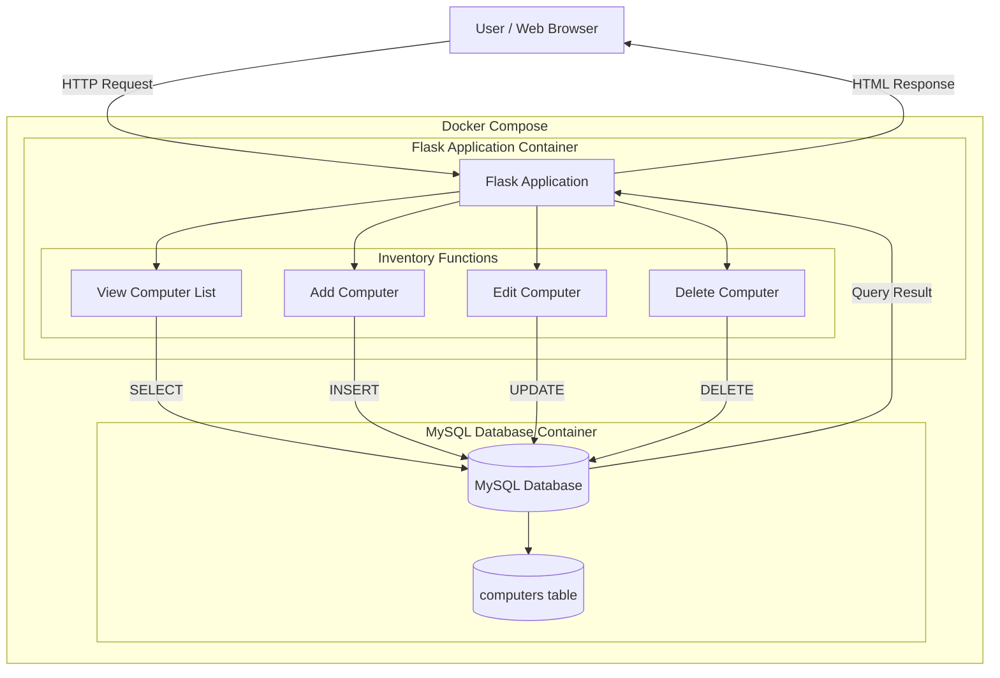

# Computer Inventory Management System

ระบบจัดการข้อมูลคอมพิวเตอร์ (Computer Inventory Management System) พัฒนาด้วย **Python Flask** และ **MySQL** โดยใช้ **Docker และ Docker Compose** สำหรับจัดการและรัน Application กับ Database ภายใน Container

## System Architecture




## Features

ระบบสามารถจัดการข้อมูลคอมพิวเตอร์ได้ดังนี้

- แสดงรายการคอมพิวเตอร์ทั้งหมด
- เพิ่มข้อมูลคอมพิวเตอร์
- แก้ไขข้อมูลคอมพิวเตอร์
- ลบข้อมูลคอมพิวเตอร์
- จัดเก็บข้อมูลใน MySQL Database
- จำกัดการลบข้อมูลเฉพาะการเข้าถึงจาก Localhost
- รัน Web Application และ Database ด้วย Docker Compose

---

## Technologies Used

โปรเจกต์นี้ใช้เทคโนโลยีดังต่อไปนี้

| Technology | Description |
|---|---|
| Python | ภาษาหลักสำหรับพัฒนา Backend |
| Flask | Framework สำหรับพัฒนา Web Application |
| MySQL | ระบบจัดการฐานข้อมูล |
| mysql-connector-python | Library สำหรับเชื่อมต่อ Python กับ MySQL |
| HTML | ใช้สร้างหน้าเว็บไซต์ |
| Docker | ใช้สร้างและรัน Application ภายใน Container |
| Docker Compose | ใช้จัดการ Web Application และ Database หลาย Container |

---

# Project Structure

```text
computer-inventory/
│
├── .gitignore
├── app.py
├── diagram.md
├── docker-compose.yml
├── Dockerfile
├── README.md
├── requirements.txt
│
├── db/
│   └── init.sql
│
└── templates/
    ├── add.html
    ├── edit.html
    └── index.html
