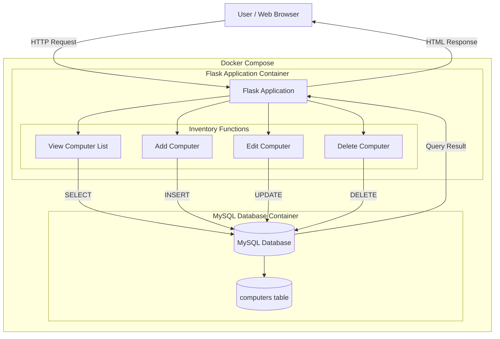

```mermaid
flowchart TD
    User[User / Web Browser]

    subgraph Docker[Docker Compose]
        subgraph FlaskContainer[Flask Application Container]
            Flask[Flask Application]

            subgraph Functions[Inventory Functions]
                View[View Computer List]
                Add[Add Computer]
                Edit[Edit Computer]
                Delete[Delete Computer]
            end
        end

        subgraph MySQLContainer[MySQL Database Container]
            MySQL[(MySQL Database)]
            ComputerTable[(computers table)]
        end
    end

    User -->|HTTP Request| Flask

    Flask --> View
    Flask --> Add
    Flask --> Edit
    Flask --> Delete

    View -->|SELECT| MySQL
    Add -->|INSERT| MySQL
    Edit -->|UPDATE| MySQL
    Delete -->|DELETE| MySQL

    MySQL --> ComputerTable

    MySQL -->|Query Result| Flask
    Flask -->|HTML Response| User
```